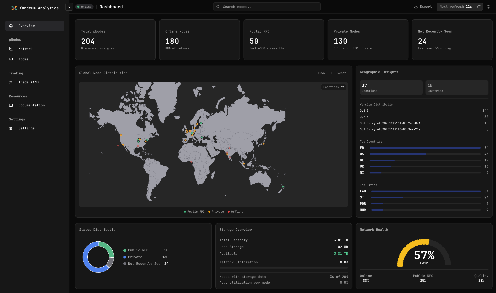

# Xandeum pNode Analytics Platform

<p align="center">
  
</p>

<p align="center">
  <strong>Real-time monitoring and analytics for the Xandeum pNode network</strong>
</p>

<p align="center">
  <a href="https://docs.xandeum.network">Official Docs</a> •
  <a href="https://x.com/xandeumstats">Twitter</a> •
  <a href="https://discord.gg/xandeum">Discord</a>
</p>

---

## 🎯 Overview

The **Xandeum pNode Analytics Platform** is a comprehensive monitoring solution for the Xandeum decentralized storage network. It provides:

- **Real-time Network Monitoring** - Track 200+ pNodes globally
- **Performance Analytics** - CPU, RAM, storage, and uptime metrics
- **Geographic Visualization** - Interactive world map of node distribution
- **Token Analytics** - XAND price, liquidity, and market data
- **AI Assistant (Xandbot)** - Ask questions about the network
- **Pod Credits Leaderboard** - Node rankings by lifetime credits

---

## 🏗️ Platform Architecture

```
┌─────────────────────────────────────────────────────────────────────────┐
│                           XANDEUM NETWORK                                │
│  ┌─────────────┐  ┌─────────────┐  ┌─────────────┐  ┌─────────────┐    │
│  │   pNode 1   │  │   pNode 2   │  │   pNode 3   │  │   pNode N   │    │
│  └──────┬──────┘  └──────┬──────┘  └──────┬──────┘  └──────┬──────┘    │
│         │                │                │                │            │
│         └────────────────┼────────────────┼────────────────┘            │
│                          │                │                              │
│                    ┌─────▼────────────────▼─────┐                       │
│                    │     pRPC (Gossip Layer)    │                       │
│                    └─────────────┬──────────────┘                       │
└──────────────────────────────────┼──────────────────────────────────────┘
                                   │
                    ┌──────────────▼──────────────┐
                    │    ANALYTICS BACKEND        │
                    │  ┌────────────────────────┐ │
                    │  │   Sync Service (30s)   │ │
                    │  │   • Fetch from pRPC    │ │
                    │  │   • Geo-location       │ │
                    │  │   • Stats aggregation  │ │
                    │  └──────────┬─────────────┘ │
                    │             │               │
                    │  ┌──────────▼─────────────┐ │
                    │  │      PostgreSQL        │ │
                    │  │   (DigitalOcean DB)    │ │
                    │  └──────────┬─────────────┘ │
                    │             │               │
                    │  ┌──────────▼─────────────┐ │
                    │  │    Redis (Upstash)     │ │
                    │  │      Response Cache    │ │
                    │  └────────────────────────┘ │
                    │                             │
                    │     Hono API Server         │
                    └──────────────┬──────────────┘
                                   │
                    ┌──────────────▼──────────────┐
                    │    ANALYTICS DASHBOARD      │
                    │                             │
                    │  • Real-time Charts         │
                    │  • Interactive Node Map     │
                    │  • Token Analytics          │
                    │  • Xandbot AI Assistant     │
                    │  • Wallet Integration       │
                    │                             │
                    └─────────────────────────────┘
```

---

## 🛠️ Tech Stack

### Backend (`xandeum-analytics/`)

| Technology | Purpose |
|------------|---------|
| **[Hono](https://hono.dev)** | Fast, lightweight web framework |
| **[Prisma](https://prisma.io)** | Type-safe database ORM |
| **[PostgreSQL](https://postgresql.org)** | Primary database (DigitalOcean) |
| **[Upstash Redis](https://upstash.com)** | Response caching (30s TTL) |
| **[Zod](https://zod.dev)** | Runtime validation |
| **[Pino](https://getpino.io)** | Structured logging |
| **[PM2](https://pm2.keymetrics.io)** | Process management |

### Frontend (`xandeum-dashboard/`)

| Technology | Purpose |
|------------|---------|
| **[Next.js 16](https://nextjs.org)** | React framework (App Router) |
| **[Shadcn UI](https://ui.shadcn.com)** | Component library |
| **[Tailwind CSS](https://tailwindcss.com)** | Utility-first styling |
| **[Recharts](https://recharts.org)** | Data visualization |
| **[React Simple Maps](https://react-simple-maps.io)** | Geographic maps |
| **[TanStack Query](https://tanstack.com/query)** | Data fetching & caching |
| **[Framer Motion](https://motion.dev)** | Animations |
| **[AI SDK](https://sdk.vercel.ai)** | Xandbot AI integration |
| **[Solana Wallet Adapter](https://github.com/solana-labs/wallet-adapter)** | Wallet connectivity |

### External APIs

| Service | Purpose |
|---------|---------|
| **pRPC** | Node gossip data |
| **DexScreener** | XAND token prices |
| **Pod Credits API** | Node credit scores |
| **Gemini AI** | Xandbot responses |
| **ip-api.com** | Geo-location |

---

## ✨ Features

### 📊 Real-time Dashboard
- Live network statistics (total nodes, online, public RPC)
- Interactive world map with clustered markers
- Status distribution donut chart
- Storage utilization overview
- Network health gauge

### 🖥️ Node Monitoring
- Comprehensive node list with filtering
- Individual node detail pages
- CPU, RAM, storage metrics
- Uptime and version tracking
- Public key and location info

### 💰 Token Analytics
- XAND price with 24h change
- Liquidity tracking
- Price history charts
- Swap interface (Jupiter integration)

### 🏆 Pod Credits
- Lifetime credit scores per node
- Network rank (#1 of N nodes)
- Performance tier badges (Top 10%, 25%, etc.)
- Top performers leaderboard

### 🤖 Xandbot AI Assistant
- Powered by Google Gemini
- Trained on official Xandeum documentation
- Real-time network context
- Topic-restricted to Xandeum only
- Rate limited (10 req/min)

### 🎨 Theming
- Light/Dark mode
- Custom Xandeum brand theme
- Responsive design (mobile-friendly)

---

## 📂 Project Structure

```
xandeum-analytics/
├── xandeum-analytics/        # Backend API
│   ├── src/
│   │   ├── routes/pnodes/    # API endpoints
│   │   └── lib/              # Clients & utilities
│   └── prisma/               # Database schema
│
├── xandeum-dashboard/        # Frontend App
│   ├── app/
│   │   ├── dashboard/        # Dashboard pages
│   │   └── api/              # Next.js API routes
│   ├── components/
│   │   ├── dashboard/        # Feature components
│   │   └── ui/               # Shadcn components
│   ├── hooks/                # Custom hooks
│   └── lib/                  # Types & utilities
│
└── README.md                 # This file
```

---

## 🚀 Quick Start

### Prerequisites
- Node.js 20+
- pnpm
- PostgreSQL database
- Redis/Upstash account

### Backend

```bash
cd xandeum-analytics
pnpm install
cp .env.example .env
# Configure DATABASE_URL, UPSTASH_*, PRPC_URL
pnpm migrate
pnpm dev
```

### Frontend

```bash
cd xandeum-dashboard
pnpm install
cp .env.example .env.local
# Configure NEXT_PUBLIC_API_URL, GEMINI_API_KEY
pnpm dev
```

---

## 📜 License

**GNU Affero General Public License v3.0 (AGPL-3.0)**

If you run a modified version as a web service, you must make your source code public.

---

<p align="center">
  Made with ❤️ for the Xandeum community
</p>
